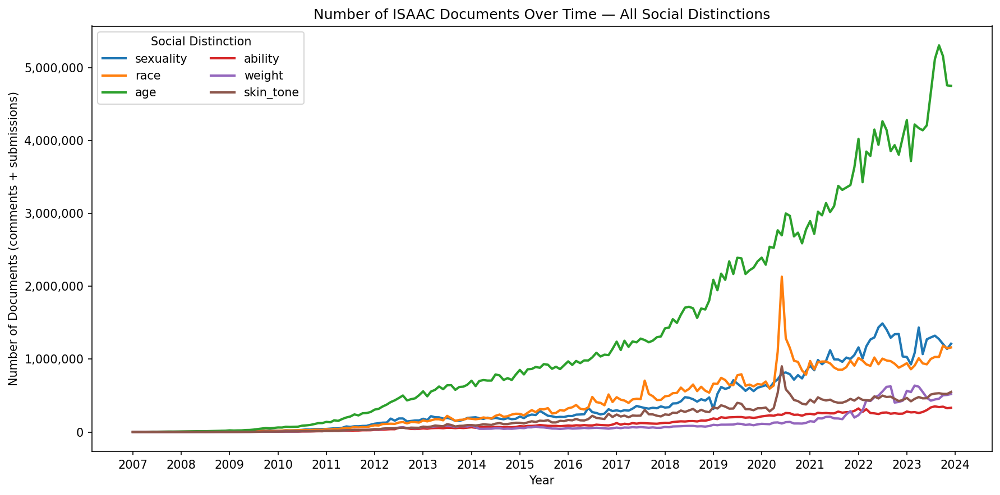

<p align="center">
  
</p>

<h1 align="center">Illinois Social Attitudes Aggregate Corpus</h1>

This repository contains tools for the development and evaluation of the **Illinois Social Attitudes Aggregate Corpus (ISAAC)**, a comprehensive dataset of Reddit discourse from 2007 to 2023 about social groups defined by distinctions based on sexuality, race, age, ability, weight and skin-tone. Submissions and comments in ISAAC are being labeled using the scripts in this folder for **a variety of social-psychological variables** of interest, including moralization, generalization, sentiment, emotions and state-level US location mapping. The resources are designed to be easily adapted for developing similar datasets targeting other distinctions (see [Adaptations](#adaptations)). 

**ATTENTION:** By using this repository or the associated data and tools you agree to the [Terms of Use](./Terms_of_Use.md). 

**Corpus size (comments): 462,479,309 posts**

**Corpus size (submissions): 64,581,610 posts**

**Corpus size (combined): 527,060,919 posts**

![Number of documents (comments + submissions) per social distinction. Each bar stacks comments (bottom) and submissions (top); the combined total is annotated above each bar. sexuality (gay-straight; 67,552,683 comments + 12,014,516 submissions = 79,567,199); race (Black-White; 72,641,057 + 9,707,554 = 82,348,611); age (young-old; 250,791,532 + 29,411,923 = 280,203,455); ability (abled-disabled; 19,322,244 + 3,633,138 = 22,955,382); weight (fat-thin; 17,191,901 + 5,165,709 = 22,357,610); skin_tone (dark-light; 34,979,892 + 4,648,770 = 39,628,662)](./freq_aggregate.png)


## Corpus Access

A coding-free website for convenient access to the full comment corpus or samples of it can be found [here](https://isaac.psychology.illinois.edu). Submissions will be integrated into the same dataset soon.

## Corpus Interpretation

You can read about the list of variables included in the corpus and their definitions [here](https://github.com/BabakHemmatian/Illinois_Social_Attitudes/blob/main/variable_list.md). We are currently adding social-psychological and location labels to the uploaded version of the corpus, but users can find plug-and-play scripts in this repository for extracting them themselves. 

## The Current Repository

This repository contains the scripts that allow you to rebuild ISAAC from scratch by:
- Filtering Reddit content by keywords and the use of English language. 
- Applying pre-trained neural networks and complex pattern matching to prune irrelevant content picked up by keywords (e.g., "Black" in a context other than race). 
- Generating generalized language (e.g., genericity), moralization, sentiment and emotion labels for the pruned corpus.
- Estimate user location down to US state based on Reddit activity history.

The scripts were designed to be easily adapted for developing other Reddit corpora. See the [Adaptations](#adaptations) section.

**Note:**
- The scripts were developed on Windows 11, then tested on Ubuntu. However, cross-platform compatibility is not guaranteed.

## Citation
If you use this repository in your work, please cite us as follows:

### APA Format
```
Hemmatian, B., Kurdi, B. (2025). The Illinois Social Attitudes Aggregate Corpus [Computer software]. GitHub. [https://github.com/BabakHemmatian/Illinois_Social_Attitudes](https://github.com/BabakHemmatian/Illinois_Social_Attitudes)
```
### BibTex Format
```
**BibTex: **
@misc{Hemmatian2026,
  author       = {Hemmatian, Babak and Kurdi, Benedek},
  title        = {Illinois_Social_Attitudes},
  year         = {2026},
  publisher    = {GitHub},
  journal      = {GitHub repository},
  howpublished = {\url{[https://github.com/yourusername/your-repository](https://github.com/BabakHemmatian/Illinois_Social_Attitudes)}},
}
```
## How To Use

### Repository Setup
Install [Git](https://git-scm.com/book/en/v2/Getting-Started-Installing-Git) on your computer. When finished, open a command line terminal, navigate to where you would like to place the repository, then enter ```git clone https://github.com/BabakHemmatian/Illinois_Social_Attitudes.git```. Note that the raw and processed data files for the full 2007-2023 take several terabytes of space. Choose the repository location according to your use case's storage needs.

Download [this folder](https://drive.google.com/drive/folders/1TqxjRRMZ3LTGWRCMkK6_tnIo_Zg1vms1?usp=sharing) into the newly created ```Illinois_Social_Attitudes``` folder.

The raw Reddit data that the ```filter_keywords``` resource requires can be found and downloaded [here](https://academictorrents.com/details/ba051999301b109eab37d16f027b3f49ade2de13). The relevant .zst files for a given timeframe are to be placed in ```data/data_reddit_raw/comments/``` or ```data/data_reddit_raw/submissions/``` depending on the type of Reddit post you are targeting with your command. 

### Virtual Environment Setup
Follow the steps [here](https://docs.conda.io/projects/conda/en/latest/user-guide/install/index.html) to install the desired version of Anaconda. 

Once finished, navigate to the ```Illinois_Social_attitudes``` folder in the command line and enter ```conda create --name ISAAC python=3.11 pip```. Answer 'y' to the question. When finished, run ```conda activate ISAAC```. Once the environment is activated, run the following command to install the necessary packages: ```pip install -r requirements.txt```. 

### Commands
You can now use command line arguments to make use of the resources. Use ```python ./code/cli.py --help``` to receive more information about the available options. 

**Example:**
```
python ./code/cli.py --type comments --resource filter_keywords --group sexuality --years 2007-2009,2010
```
This example command will use the appropriate keyword lists from this repository to identify comments in the complete Pushshift-format dataset that are potentially related to sexuality, and which come from 2007-2009 and 2010. Every per-month CSV produced by a resource propagates or generates a `source_row` column. If a run fails, _any future runs will skip the already written rows and resume the work of the previous invocation_.

**NOTE:** ```filter_keywords``` should always be the first resource called as the only resource interfacing with raw reddit data. If you would like to apply the remaining resources to a dataset from sources other than the Reddit data dump indicated above, simply edit this resource as needed to properly read in the month-by-month input rows. The resulting ISAAC-compatible outputs can then be directly fed to the later resources.

**NOTE:** _label_ resources require the batch size argument (```-batchsize [integer]``` or ```-b [integer]```). Set it based on your RAM and GPU RAM capacity. Values between 200 and 4096 were used based on the resource and system parameters while developing ISAAC. Parallelization and GPU acceleration are recommended for these more resource-intensive resources (see [CPU and GPU Acceleration](#cpu-and-gpu-acceleration)).

#### Custom Resource Use Order

```filter_keywords``` must be used first. ```organize``` resources need ```filtered``` or ```labeled``` outputs to work. Otherwise, the resources can be used in customized order by adding ```--input``` and ```--output``` path arguments to a command pointing to the desired input/output directories. If not provided, the paths default to the [Default Resource Use Order](#default-resource-use-order).

### Default Resource Use Order

The scripts may be used without any changes to recreate the ISAAC corpus. To do so, call the resources without custom ```--input``` and ```--output``` path arguments in the following order for the desired social group and year range:

1. ```filter_keywords```: Uses an extremely fast algorithm to parse trillions of Reddit posts for large sets of keywords that suggest potential relevance to ISAAC's key social distinctions. 
2. ```filter_language```: Uses a pre-trained language detection model from FastText to filter out non-English posts. 
3. ```filter_relevance```: Uses a set of custom transformer-based neural networks to filter out irrelevant content picked up by the keyword method. 
4. ```filter_keywords_adv```: Uses highly-optimized complex pattern matching to remove irrelevant content not filtered by steps (1) and (3). 
5. _```label_moralization```_: Generates binary labels for whether a post's content is moralized using a custom neural network trained on [this](https://arxiv.org/pdf/2208.05545) dataset.
6. _```label_sentiment```_: Generates a range of sentiment labels for a post based on [Stanza](https://stanfordnlp.github.io/stanza/sentiment.html), [TextBlob](https://textblob.readthedocs.io/en/dev/quickstart.html) and [Vader](https://github.com/cjhutto/vaderSentiment) models. The combination of multiple models supports reliable inference.
7. _```label_generalization```_: Generates clause-by-clause labels for the linguistic features that determine the degree of generalization in each statement within a post. See the [variables list](https://github.com/BabakHemmatian/Illinois_Social_Attitudes/blob/main/variable_list.md) for more details.
8. _```label_emotion```_: Generates a range of emotion labels for a post based on the neural network models found [here](https://huggingface.co/j-hartmann/emotion-english-distilroberta-base), [here](https://huggingface.co/sickboi25/emotion-detector) and [here](https://huggingface.co/tae898/emoberta-base).
9. _```label_location```_: Estimates a post author's home location down to the state-level for US users and to global region for non-US users based on Reddit posting history. This is the slowest resource with a unique set of command line arguments and environment variables. Defaults are stringent through 2019 and comparatively relaxed for 2020–2023 to support processing within a reasonable timeframe, but can be overriden. Peak RAM per task scales with the month's raw volume: during ISAAC development we observed a median of ~19 GB and a maximum of ~35 GB per task (high-volume months from 2018 onward are the heaviest; small early months use only a few GB). Size `--mem` accordingly (we used up to ~24 GB for ≥2018 months). Each task also keeps a 1-5 GB persistent scan-progress cache on disk. See [Label Location Internals](label_location_internals.md) for details.  
10. ```organize_types```: Combines one-to-one Reddit 'comment' and 'submissions' datasets into a unified timestamp-organized dataset.
11. ```organize_anonymize```: Replaces author usernames with persistent random IDs to safeguard Reddit users' privacy. 

### Batch Processing Support

All resources support batch processing on a supercomputing cluster by adding the ```--slurm``` or ```-s``` flag to your command. Benefits will be particularly stark for ```label``` resources. Note that the specific sbatch arguments in ```slurm.sh``` need to be adjusted based on the particular cluster you are using. Several command line arguments such as ```--num-jobs``` control the behavior of the slurm versions of resources. 

### CPU and GPU Acceleration

_filter_ resources use CPU-based parallelization for extremely fast processing. 

_label_ resources, with the exception of the CPU-only ```label_location```, become much faster with Cuda-enabled GPU acceleration (available on Nvidia graphics cards, with a corresponding tool for Mac users). These resources print out the "device" as well as GPU RAM usage as part of their logging, which can be used to confirm the appropriate use of "cuda".

## Adaptations

### Adjusting Social Groups and Related Keywords
The current list of social groups and their binary subgroups are found in ```scripts/utils.py```. 

To search the entirety of Reddit for posts potentially relevant to your dimension of interest beyond those listed, change the key-value pairs for the groups variable in ```utils.py``` and the choices for the corresponding ```--group``` argument in ```cli.py```. Then, add correctly formatted and named text files to the ```keywords``` folder that contain words helpful for identifying potentially relevant content for your use case. See the existing files for examples to follow. This code base uses ```pyahocorasick``` for extremely fast recognition of dozens of keywords in billions of posts. This package allows only alphanumeric and punctuation characters. Choose your keyword format accordingly. Note that the resource scripts can be easily adjusted to allow for different orders of resource use or the application of new classification models (see below). 

### Training New Relevance Classifiers
The ```filter_sample``` resource can be used to extract stratified samples from filtered or labeled datasets to be annotated for the training of new relevance classifiers. The script assumes two annotators and by default aims for ~200 documents per rater equally distributed across the indicated years. Note that the default pathing only distinguishes samples based on ```group``` (e.g., sexuality) and ```type``` (comments, submissions or all). Move files between runs to prevent overwriting the previous samples.

Use the ```metrics_interrater``` resource with the correct ```--type``` and ```--group``` arguments to evaluate interrater agreement. Once sufficient interrater agreement is reached, use the ```train_relevance``` resource to train new relevance filtering neural networks. Adjust the social ```--group``` argument to your target and change the training hyperparameters as needed. No ```--years``` argument is required for either resource.

### Complex Pattern Matching
If there are still many irrelevant posts in your dataset, you might want to consider using complex regular expression patterns to filter them out. You can see examples of the sets created for ISAAC in the keywords folder, distinguished with ```_adv``` for "advanced" in the file names. Replace these sets with regular expressions that fit your use case and call the ```filter_keywords_adv``` resource to use the patterns for rapidly filtering your dataset based on a parallelized version of the highly-optimized hyperscan engine. 

### Label Generation
If the social-psychological labels provided alongside ISAAC work well for your use case, you can apply ```label``` resources to generate them for your new corpus. 

### Training Location Model
The ```train_location``` resources can be used to train a weighted mixture of logistic regressions for estimating user location from Reddit history (word usage, subreddits and timestamps). We found this modeling approach to be the most robust on Reddit data.
1. Run ```train_location_preprocess``` twice, once with ```Feature_Set``` set to ```words```, and a second time to ```struct```, assigning ```TASK``` based on your training goal (```top```:US vs. non-US, ```state```: US states, ```region```: Europe, Asia_Oceania, Americas and Africa). This resource requires ```jsonl``` feature frequency files for users, as well a user label ```csv```. Due to data security considerations, we do not provide our training data. To learn more about dataset development and formatting per this resource, write [us](mailto:babak.hemmatian@gmail.com). 
2. Train your ```TASK``` model on preprocessed ```words``` and ```struct``` feature sets using ```train_location_training```. 
3. Run ```train_location_weighting``` to find the best mixture model for generalizable classification. This script reports performance on both regular and masked dataset variants to help researchers ensure model generalizability.

## Acknowledgments
We thank Sarah Hadjarab, Jessica Chen and Rui Yu for their help with script and data development. Claude Code was used in final stages of development to stress-test the repository.
