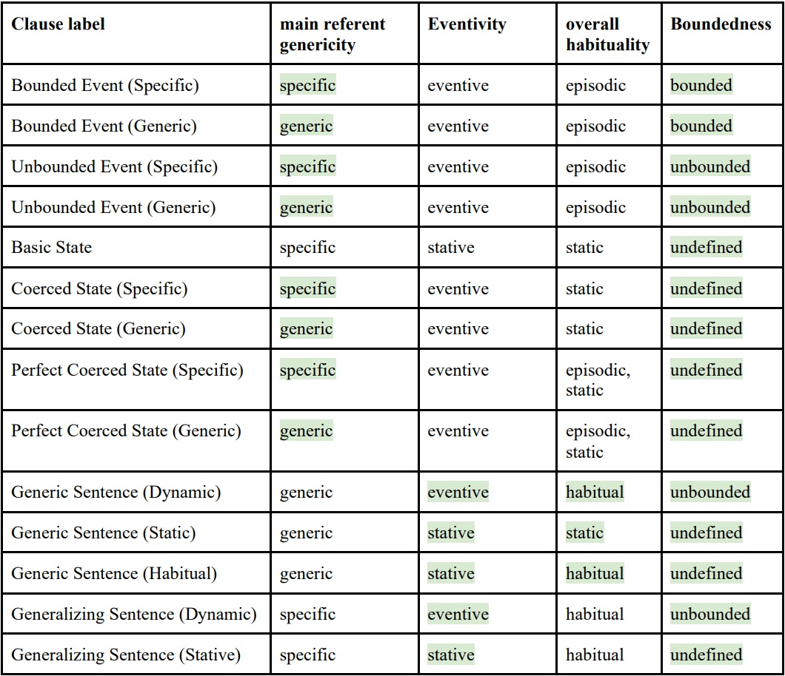

# Information about Corpus Variables 

Each row in ISAAC represents a Reddit submission or comment associated with its target social group. Below you can find definitions and additional information about the variables included with ISAAC for each post, organized based on the columns within the data files. If you have any questions or concerns about the corpus contents, please write to [Babak Hemmatian, Ph.D](mailto:babak.hemmatian@gmail.com).

1. **id**: a Reddit submission or comment's unique identifier. 
2. **parent id**: the unique identifier for the submission under which a comment appears.
3. **text**: the content of the Reddit submission or comment.
4. **author**: the account associated with a Reddit post.
5. **time**: the time in GMT when the post was created.
6. **subreddit**: the subreddit to which a post belongs.
7. **score**: the relative count of likes and dislikes on a post. Positive numbers indicate more likes than dislikes.
8. **matched_patterns**: the set of keywords that identified the post as potentially relevant to the target social group prior to AI-based pruning.
9. **source_row**: for development purposes. Will be removed from the final product.
10. **moralization**: AI-based binary estimation of whether the post's content is moralized.
11. **Sentiment_Stanza_Pos**: The number of sentences in the post showing a positive sentiment according to [Stanza](https://github.com/stanfordnlp/stanza). This is an AI-based tool based on a broad range of training data.
12. **Sentiment_Stanza_Neu**: The number of neutral sentiment sentences in the post according to Stanza.
13. **Sentiment_Stanza_Neg**: The number of negative sentiment sentences in the post according to Stanza.
14. **Sentiment_Vader_Compound**: The average overall sentiment of the post according [Vader](https://github.com/cjhutto/vaderSentiment). This is a rule-based tool based on social media data.
15. **Sentiment_TextBlob_Polarity**: The average overall sentiment of the post according to [TextBlob](). This is an AI-based tool trained on movie reviews. Positive values show positive sentiment.
16. **Sentiment_TextBlob_Subjectivity**: The average subjectivity of the post according to TextBlob. Values closer to the minimum of zero indicate more objective content (e.g., sharing a news), while values closer to the maximum of 1 indicate highly subjective domains (e.g., opinion on someone's character).
17. **clauses**: Shows the list of clauses in the post, as segmented by our custom AI model. Each clause is on a separate line.
18. **Generalization_Clause_Labels**: Shows the clause-by-clause labels that determine the text's level of generalization in its statements. The labels are in the same order and format as the previous column.
**Note**: Generalized language [can be modeled as](https://www.researchgate.net/publication/356109604_Taking_the_High_Road_A_Big_Data_Investigation_of_Natural_Discourse_in_the_Emerging_US_Consensus_about_Marijuana_Legalization) the combination of four clause-level linguistic features, each of which is described in more details below. The individual labels in the current column each represent a unique combination of those features (see Table 1 below for the mapping).
19. **genericity_generic_count**: Genericity determines whether the entity a clause is about is a generic category (e.g., humanity; generic) or specific instances of one (e.g., one's friends; specific). The more specific the main referrent, the less the post is generalized. This column shows the number of clauses that were about a more "generic" entity. 
20. **genericity_specific_count**: This column shows the number of clauses that were about a more "specific" entity (see column 19).
21. **eventivity_stative_count**: a.k.a. fundamental semantic aspect, eventivity determines whether the clause's verb complex describes a state (e.g., God is benevolent; stative) or an event (e.g., I went to Nebraska; dynamic). Dynamic statements are less generalized than stative statements. This column shows the number of clauses that are "stative". 
22. **eventivity_dynamic_count**: This column shows the number of clauses whose eventivity is "dynamic". See column 22.
23. **boundedness_static_count**: Boundedness reflects whether any events presented have a temporal boundary (e.g., I ate this morning; episodic) or do not (e.g., God loves us; static). Stative clauses are automatically considered static. The less bounded a clause is, the more generalized the statement. This column shows the number of "static" clauses.
24. **boundedness_episodic_count**: This column shows the number of "episodic" clauses. See column 23.
25. **habitual_count**: Habituality reflects whether any events described by a clause are presented as repeating over time (e.g., I went to school there for years; habitual). Stative clauses are automatically considered non-habitual. Habituality makes an eventive clause more generalized. This column shows the number of "habitual" clauses.
26. **NA_count**: The generalized language attributes described above are only defined for statements, not clauses that reflect imperatives, questions, or exclamations. This column shows the number of clauses in the text for which the four generalization attributes are undefined.

27-34. **[attribute]\_[value]\_[proportion]**: Similar to 19-26, but showing the proportion of clauses that are of a certain type, rather than the frequency.

35-54. **[model_no]_[emotion]**: A 0-1 score from the ```[model_no]``` AI model for how much the text represents the specified ```[emotion]```. More information about models 1-3 can be found [here](https://huggingface.co/j-hartmann/emotion-english-distilroberta-base), [here](https://huggingface.co/sickboi25/emotion-detector) and [here](https://huggingface.co/tae898/emoberta-base).

55. **location**: The user's home location based on a weighted, hierarchical model of their Reddit history (word usage, subreddit activity and post timestamps). At the coarsest level, it separates 'US' from 'Non-US' users. Non-US users are further divided into 'ASIA-OCEANIA','AMERICAS','AFRICA' and 'EUROPE' subgroups. US users are divided down to the state level using two letter codes (e.g., AK for Arkansas). If confidence thresholds are not met for predictions at a finer level, the higher level label is listed. If no high-confidence labels could be assigned, this field says UNK for 'unknown'. 

56. **location_prob**: The model-assigned probability for the label in column 55. Empty if assigned location is UNK. 

57. **contender_location**: The second-most likely label for the user's home location per the model. Could be the top non-UNK label if the assigned location is UNK. 

58. **contender_location_prob**: The model-assigned probability for the contender location in column 57.

59. **type**: The Reddit post type (comment or submission) that represents the current row's entry. 

 <figure>
  
  <figcaption>
    <strong>Table 1</strong>. Clause labels for linguistic generalization (column 1) as a function of genericity, eventivity, boundedness and habituality.
  </figcaption>
</figure>
